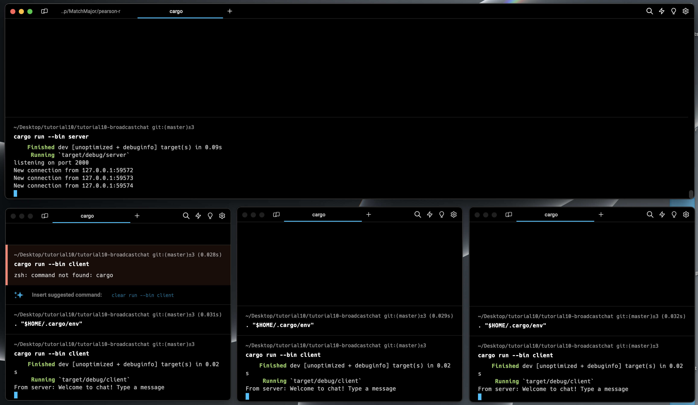
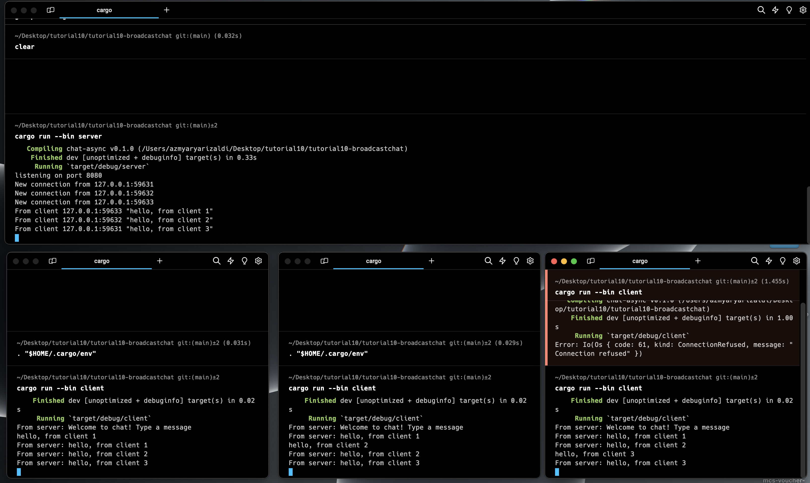
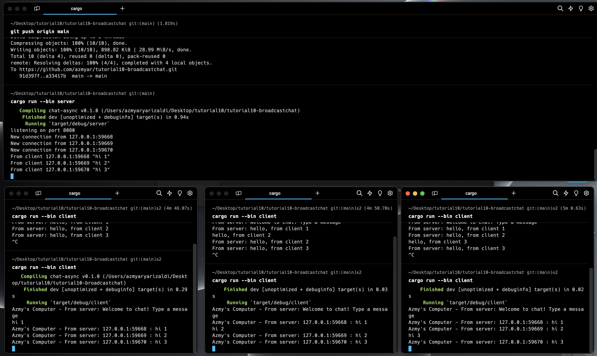

# Module 10
> M Azmy Arya Rizaldi M - 2206081704

## Original Code of Broadcast Chat

Clients and server interact via WebSocket. So, when one client sends a message, the server forwards it to all connected clients. This results in a broadcast effect where a message sent by one client is received by all connected clients.

## Modifying Port

To ensure proper functioning, we need to modify both ports (in client.rs and server.rs). If either of them has a different port from the other, the client won't be able to connect to the server.

## Small Changes

At this stage, we add sender information for each client, including IP and Port. This allows the client to know who sent the message. This change can be made by modifying the format of bcast_tx.send in server.rs.
